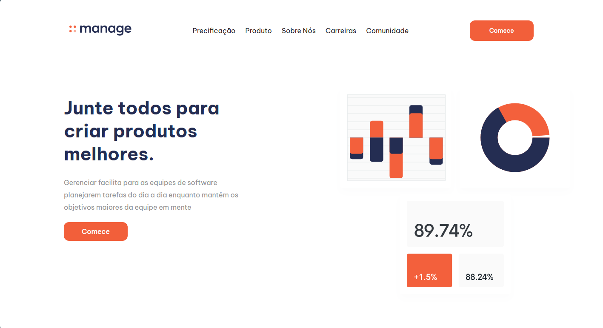

# 📝 Projeto: Página de landing page gerenciamento de produtos e serviços da manager



👨‍💻 **Autor:** Anderson de Souza Júnior | Desenvolvedor Fullstack (Em formação)  
💻 **Tecnologias:** VS Code, HTML5, CSS3, Flexbox e JS básico  

---

## 🎯 Objetivo


---

## 📝 Sobre o Projeto

O projeto é uma página de landing page da manager focado em servições de softwares e contratação de trabalhadores, focados 
em oferecer um seu trabalho na página, um sistema web focado em escabilidade e manutenção futura e um código documentados pensados para outros desenvolvedores lerem no futuro ou um outro eu do futuro que fará as novas atualizações.

---

## 🛠 Correções e Atualizações

- ✅ **Layout Moderno:** Aplicação de Flexbox e boas práticas de design.  
- ✅ **Semântica e SEO:** Uso de elementos HTML5 e Meta Tags para melhor indexação.
- ✅ **Acessbilidade e manutenção futura :** Uso de elementos de acessibilidade como alt, title, arial-label e "variables.css" pensado para escabilidade e personalização personalizável da página em questão de minutos.
- ✅ **Responsividade:** Uso de responsividade.css para que todos os dispositivos móveis possam acessar a página em diferentes dispositivos na página

---

## 📚 Aprendizados e Desafios

- ⚠️ **Formulário de preenchimento de dados:** O sistema de formulário de preenchimento dados ainda não foi adicionado ao sistema.
- ⚠️ **Em andamento:** Ajuste de responsividade para dispositivos móveis, garantindo que o layout se adapte a qualquer tamanho de tela.  

---

## 🌐 Visualização do Projeto

🔴 **Visualização em Tempo Real:**

- 🌍 [Acessar via GitHub Pages]( https://andersondesouzajrfullstack-tech.github.io/landing-page-gerenciamento-de-produtos-manager/)

> Permite que recrutadores explorem e testem o projeto diretamente no navegador.

---

## 💻 Como Testar o Projeto no VS Code

Siga os passos abaixo para executar o projeto localmente:

1. Clone o repositório:
   ```bash
   git clone COLE_AQUI_O_LINK_DO_SEU_REPOSITORIO

---

## ⭐ Conecte-se Comigo

- 🔗 [Meu LinkedIn](https://www.linkedin.com/in/anderson-de-souza-j%C3%BAnior-4791463b3/)
- 💻 [Meu GitHub](https://github.com/andersondesouzajrfullstack-tech/form-minecraft) 
- 📧 Meu E-mail: andersondesouzajr.fullstack@gmail.com
- 🌐 Portfólio (Em breve)

## 🧾 Minha Filosofia

> "Não aceitamos teoria sem aplicabilidade real."
